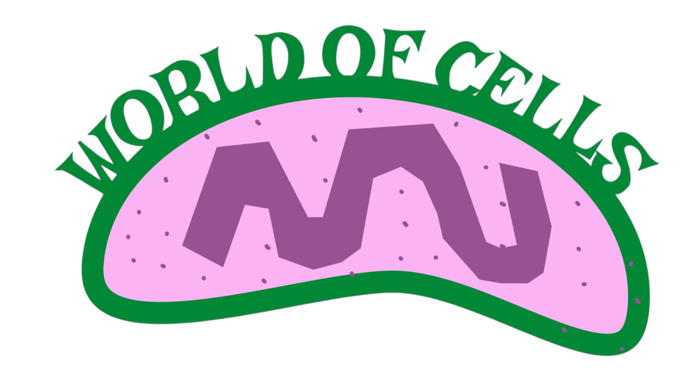

# 🧬 World of Cells - Interactive Human Cell Atlas

<div align="center">
  
  <br>
  <em>A comprehensive, interactive web application exploring the fascinating world of human cells through detailed information, research references, and modern web technologies.</em>
  <br><br>
  <a href="https://worldofhumancells.vercel.app" target="_blank">
    
  </a>
</div>

---

## ✨ Features

### 🔍 **Interactive Cell Exploration**
- **Comprehensive Cell Database**: 200+ human cell types with detailed information
- **Smart Search**: Real-time search with dropdown results for quick navigation
- **AI-Powered Search**: Advanced AI search with natural language processing
- **Cell Grouping**: Organized by tissue types (Epithelial, Muscular, Nervous, etc.)
- **Detailed Cell Pages**: Individual pages for each cell with comprehensive data
- **Cell Comparison**: Side-by-side comparison of different cell types
- **Research Timeline**: Interactive timeline of cell research discoveries

### 🤖 **AI-Powered Features**
- **Intelligent Chatbot**: AI assistant for cell biology questions using Groq API
- **React Markdown Support**: Rich formatting for AI responses with syntax highlighting
- **Context-Aware Responses**: Biology-focused AI that understands cell terminology
- **Mobile-Optimized Chat**: Responsive chatbot interface for all devices

### 📚 **Rich Content & Research**
- **Embryonic Origin**: Developmental biology information for each cell
- **Discovery Details**: Historical context with scientist names and years
- **Function & Location**: Detailed cellular functions and anatomical locations
- **Disease Associations**: Related medical conditions and pathologies
- **Research References**: Curated research papers, articles, and conference materials
- **Tissue Engineering**: Current research applications and regenerative medicine
- **Interactive Timeline**: Visual timeline of research milestones and discoveries

### 🎨 **Modern User Experience**
- **Typography Preloader**: Elegant multi-language preloader with smooth animations
- **Responsive Design**: Optimized for all devices (mobile, tablet, desktop)
- **Hamburger Navigation**: Mobile-friendly navigation menu for smaller screens
- **Dark/Light Mode**: Toggle between themes for comfortable viewing
- **Performance Optimized**: React optimizations, code splitting, and lazy loading
- **Accessibility**: Screen reader friendly with proper semantic markup
- **PWA Support**: Progressive Web App capabilities with offline functionality

### 🚀 **Technical Excellence**
- **React 18**: Modern React with hooks and functional components
- **Performance Monitoring**: Real-time FPS, memory, and load time tracking
- **Code Splitting**: Route-based lazy loading for optimal performance
- **Tailwind CSS**: Utility-first CSS framework for consistent design
- **Responsive Hooks**: Custom hooks for device-specific functionality

## 🏗️ Project Structure

```
Anatomy copy/
├── public/                    # Static assets
│   ├── images/               # Cell microscopy images
│   ├── icons/                # Cell type icons (including ChatAI.png)
│   ├── manifest.json         # PWA manifest
│   ├── sw.js                 # Service worker
│   └── index.html            # Main HTML file
├── src/                      # Source code
│   ├── components/           # Reusable components
│   │   ├── AISearch.jsx      # AI-powered search modal
│   │   ├── AppWithPreloader.jsx # Preloader wrapper
│   │   ├── CellAI.jsx        # AI chatbot component
│   │   ├── CellComparison.jsx # Cell comparison modal
│   │   ├── HamburgerMenu.jsx # Mobile navigation menu
│   │   ├── OptimizedImage.jsx # Image optimization component
│   │   ├── PerformanceMonitor.jsx
│   │   ├── Preloader.jsx     # Typography preloader
│   │   ├── SkeletonLoader.jsx # Loading skeleton
│   │   ├── ThemeToggle.jsx
│   │   └── TimelineView.jsx  # Research timeline modal
│   ├── contexts/             # React contexts
│   │   └── ThemeContext.jsx
│   ├── data/                 # Data files
│   │   ├── cells.json        # Cell database
│   │   └── timeline.json     # Research timeline data
│   ├── hooks/                # Custom hooks
│   │   ├── useDebounce.js    # Search debouncing
│   │   ├── usePWA.js         # PWA functionality
│   │   └── useResponsive.js  # Responsive breakpoints
│   ├── pages/                # Page components
│   │   ├── Home.jsx          # Main landing page
│   │   ├── GroupPage.jsx     # Cell group pages
│   │   ├── CellPage.jsx      # Individual cell pages
│   │   └── HumanCellIntro.jsx
│   ├── utils/                # Utility functions
│   │   └── imageOptimizer.js # Image optimization utilities
│   ├── App.jsx               # Main app component
│   ├── index.js              # Entry point
│   └── index.css             # Global styles with animations
├── .env.example              # Environment variables template
├── .gitignore               # Git ignore rules
├── package.json             # Dependencies and scripts
├── tailwind.config.js       # Tailwind configuration
└── README.md                # This file
```

## 🚀 Getting Started

### Prerequisites
- Node.js (v16 or higher)
- npm or yarn package manager

### Installation

1. **Clone the repository**
   ```bash
   git clone <repository-url>
   cd "Anatomy copy"
   ```

2. **Install dependencies**
   ```bash
   npm install
   ```

3. **Set up environment variables**
   ```bash
   # Create .env file
   cp .env.example .env
   
   # Add your Groq API key to .env
   echo "REACT_APP_GROQ_API_KEY=your_groq_api_key_here" >> .env
   ```

4. **Start development server**
   ```bash
   npm start
   ```

5. **Open your browser**
   Navigate to `http://localhost:3000`

### Build for Production

```bash
npm run build
```

The optimized build will be created in the `build/` directory.

## 📱 Usage

### **Homepage Navigation**
- **Search Bar**: Type any cell name for instant results
- **AI Search**: Advanced AI-powered search with natural language processing
- **Cell Groups**: Click on tissue type categories
- **Compare Cells**: Side-by-side comparison of different cell types
- **Research Timeline**: Interactive timeline of cell research discoveries
- **Human Cell Intro**: Learn about cell biology basics
- **Theme Toggle**: Switch between light and dark modes
- **Hamburger Menu**: Mobile-friendly navigation (screens < 1100px)

### **AI-Powered Features**
- **Chatbot**: Click the floating AI button to ask cell biology questions
- **Smart Responses**: AI understands cell terminology and provides detailed answers
- **Markdown Formatting**: Rich text responses with syntax highlighting
- **Mobile Optimized**: Responsive chat interface for all devices

### **Exploring Cells**
1. **Search**: Use the search bar to find specific cells
2. **AI Search**: Ask natural language questions about cells
3. **Browse Groups**: Navigate through tissue type categories
4. **Cell Details**: Click on any cell to view comprehensive information
5. **Compare Cells**: Select multiple cells for side-by-side comparison
6. **Research Timeline**: Explore historical discoveries and milestones
7. **Research Links**: Access curated research references for each cell
8. **Further Learning**: Use "Want to Learn More?" buttons for additional research

### **Research References**
Each cell page includes:
- **Curated Research Links**: Hand-picked papers and articles
- **PubMed Search**: Direct links to scientific literature
- **Web Search**: Broader research on specific cell types
- **Cell Group Navigation**: Related cell type exploration
- **Interactive Timeline**: Visual representation of research milestones

### **Mobile Experience**
- **Hamburger Menu**: Compact navigation for smaller screens
- **Responsive Design**: Optimized layouts for all screen sizes
- **Touch-Friendly**: Large buttons and touch-optimized interactions
- **PWA Support**: Install as a mobile app with offline capabilities

## 🧪 Performance Features

### **Optimization Techniques**
- **React.memo()**: Prevents unnecessary re-renders
- **useCallback**: Memoized event handlers
- **useMemo**: Cached expensive calculations
- **Code Splitting**: Lazy-loaded route components
- **Debounced Search**: Optimized search performance

### **Performance Monitoring**
- **FPS Tracking**: Real-time frame rate monitoring
- **Memory Usage**: Current memory consumption
- **Load Times**: Page performance metrics
- **Development Only**: Automatically hidden in production

## 🎨 Customization

### **Adding New Cells**
1. Edit `src/data/cells.json`
2. Add new cell entry with required fields
3. Include relevant research references
4. Add corresponding images to `public/images/`

### **Modifying References**
Each cell can have custom research references:
```json
{
  "name": "Cell Name",
  "references": [
    {
      "title": "Research Paper Title",
      "source": "Journal Name",
      "year": "2023",
      "type": "Research Article",
      "url": "https://example.com/paper"
    }
  ]
}
```

### **Theme Customization**
- Modify `src/contexts/ThemeContext.js` for theme logic
- Update `tailwind.config.js` for color schemes
- Customize component themes in individual files

## 🔧 Technical Details

### **Key Technologies**
- **Frontend**: React 18, React Router v6
- **Styling**: Tailwind CSS, CSS-in-JS
- **State Management**: React Context API, Local Storage
- **Build Tool**: Create React App
- **Performance**: React DevTools, Custom monitoring
- **AI Integration**: Groq API for intelligent responses
- **Animations**: Framer Motion for smooth transitions
- **Markdown**: React Markdown with syntax highlighting
- **PWA**: Service Worker, Web App Manifest
- **Responsive**: Custom hooks for breakpoint management

### **Browser Support**
- Chrome (latest)
- Firefox (latest)
- Safari (latest)
- Edge (latest)

### **Performance Targets**
- **First Contentful Paint**: < 1.5s
- **Largest Contentful Paint**: < 2.5s
- **Cumulative Layout Shift**: < 0.1
- **First Input Delay**: < 100ms

## 🤝 Contributing

### **Development Guidelines**
1. **Code Style**: Follow existing React patterns
2. **Performance**: Use React optimization techniques
3. **Accessibility**: Maintain screen reader compatibility
4. **Testing**: Test on multiple devices and browsers
5. **Documentation**: Update README for new features

### **Adding Features**
1. **Research**: Ensure scientific accuracy
2. **Design**: Maintain consistent UI/UX
3. **Performance**: Optimize for speed and efficiency
4. **Accessibility**: Include proper ARIA labels
5. **Documentation**: Update relevant documentation

## 📚 Data Sources

### **Cell Information**
- **Scientific Literature**: Peer-reviewed research papers
- **Medical Databases**: PubMed, ScienceDirect, Nature
- **Textbooks**: Standard anatomy and cell biology references
- **Expert Review**: Validated by scientific community

### **Research References**
- **Recent Publications**: 2022-2023 research papers
- **High-Impact Journals**: Nature, Science, Cell, etc.
- **Clinical Studies**: Medical research and clinical trials
- **Review Articles**: Comprehensive scientific summaries

## 🆕 New Features (Latest Update)

### **AI-Powered Enhancements**
- **Intelligent Chatbot**: Ask questions about cell biology and get detailed AI responses
- **Natural Language Search**: Search using conversational queries
- **Markdown Support**: Rich formatting in AI responses with syntax highlighting
- **Context Awareness**: AI understands cell biology terminology and concepts

### **User Experience Improvements**
- **Typography Preloader**: Elegant loading screen with multi-language support
- **Mobile Navigation**: Hamburger menu for screens under 1100px width
- **Cell Comparison**: Side-by-side comparison of different cell types
- **Research Timeline**: Interactive timeline of cell research discoveries
- **Enhanced Responsiveness**: Optimized layouts for all screen sizes

### **Technical Upgrades**
- **PWA Support**: Install as a mobile app with offline capabilities
- **Environment Variables**: Secure API key management
- **Performance Optimizations**: Improved loading times and animations
- **Code Organization**: Better component structure and maintainability

## 🚨 Troubleshooting

### **Common Issues**

**Search not working**
- Check browser console for errors
- Ensure all dependencies are installed
- Verify `cells.json` file integrity

**AI Chatbot not responding**
- Verify `REACT_APP_GROQ_API_KEY` is set in `.env` file
- Check internet connection
- Ensure API key is valid and has sufficient credits

**Images not loading**
- Check image file paths in `public/images/`
- Verify file permissions
- Ensure image files exist

**Performance issues**
- Check Performance Monitor for metrics
- Verify code splitting is working
- Monitor memory usage in DevTools

**Mobile layout issues**
- Clear browser cache and hard refresh
- Check responsive breakpoints in browser dev tools
- Verify hamburger menu is working on smaller screens

### **Development Issues**

**Hot reload not working**
- Restart development server
- Clear browser cache
- Check file watcher limits

**Build errors**
- Verify Node.js version compatibility
- Clear `node_modules` and reinstall
- Check for syntax errors in source files

## 📄 License

This project is for educational and research purposes. All cell information and research references are sourced from publicly available scientific literature.

## 🙏 Acknowledgments

- **Scientific Community**: Researchers and scientists whose work is referenced
- **Medical Professionals**: Healthcare workers who provided clinical insights
- **Open Source**: React, Tailwind CSS, and other open-source technologies
- **Educational Institutions**: Universities and research centers

## 📞 Support

For questions, issues, or contributions:
- **Issues**: Create a GitHub issue
- **Documentation**: Check this README and code comments

---

## 📦 Dependencies

### **Core Dependencies**
- **React**: 18.2.0 - UI library
- **React Router**: 6.8.0 - Client-side routing
- **Tailwind CSS**: 3.3.0 - Utility-first CSS framework

### **New Dependencies**
- **Framer Motion**: 10.16.0 - Animation library for smooth transitions
- **React Markdown**: 9.0.0 - Markdown rendering for AI responses
- **Remark GFM**: 4.0.0 - GitHub Flavored Markdown support
- **Rehype Highlight**: 7.0.0 - Syntax highlighting for code blocks
- **Highlight.js**: 11.9.0 - Syntax highlighting library

### **Development Dependencies**
- **PostCSS**: 8.4.0 - CSS processing
- **Autoprefixer**: 10.4.0 - CSS vendor prefixing

---

**Made with ❤️ for science education and research - Pratik Kumar**

*Last updated: September 2025*
